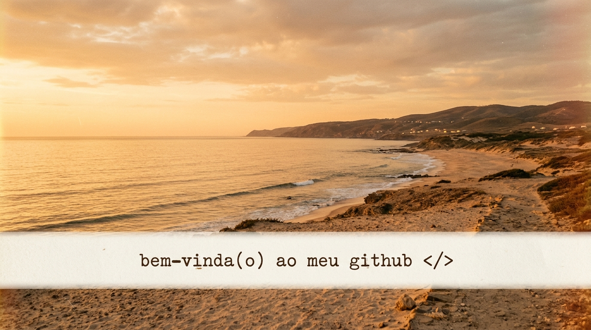
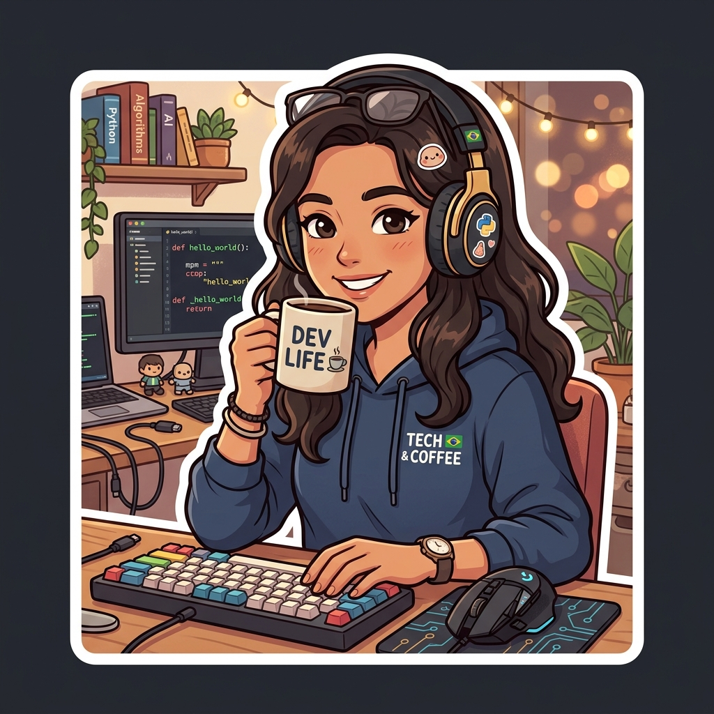

<div align="center">

  

  <br><br>

  <p align="center">
    <b>Engenheira de Software • Backend & Arquitetura • Ciência da Computação</b>
  </p>

  <p align="center">
    <a href="https://github.com/Rafa-sheSoares" target="_blank">
      
    </a>
    <a href="https://www.linkedin.com/in/rafaela-soares-softengineering" target="_blank">
      
    </a>
    <a href="mailto:rafaelasoares.dev@gmail.com">
      
    </a>
  </p>

</div>

---

### 🌸 about me

<table>
  <tr>
    <td width="30%" align="center" valign="middle">
      
    </td>
    <td width="70%" valign="top">

Me chamo **Rafaela Soares**, sou Engenheira de Software em formação com foco em **Backend**, **Arquitetura de Sistemas** e **Engenharia de Suporte / Sustentação**.

Gosto de transformar desafios e regras de negócio complexas em arquiteturas robustas, APIs resilientes e código limpo e escalável.

Minha jornada combina sólida base teórica em **Ciência da Computação** (estruturas de dados, algoritmos clássicos e análise de complexidade Big-O) com vivência prática no desenvolvimento de microsserviços, modelagem de bancos relacionais e NoSQL, integração de sistemas e suporte a incidentes críticos sob metodologias ágeis.

> 💡 *Acredito que programar não é apenas escrever código. É compreender a fundo as regras de negócio, projetar sistemas eficientes e transformar desafios em soluções sustentáveis de alto impacto.*

   </td>
  </tr>
</table>

---

### 💻 tech stack

<div align="center">
  <a href="https://skillicons.dev">
    
  </a>
</div>

---

### 🎓 academic background

<table>
  <tr>
    <td width="70%" valign="top">

* 🎓 **Ciência da Computação (Bacharelado)**  
  *Graduação em andamento • Foco em Engenharia de Software, Algoritmos & Estruturas de Dados*

* 🛠️ **Formações & Especializações Técnicas**:
  * **Java & Spring Boot**: Construção de APIs RESTful, Segurança com JWT e Migrations com Flyway
  * **Arquitetura de Software**: Microsserviços, Padrões GoF (*Observer*, *Pub/Sub*, *MVVM*) e Modelo C4
  * **Engenharia de Suporte & Sustentação**: Troubleshooting, análise de causa raiz, gestão ágil (*Scrum*, *DoR*, *DoD*)

   </td>
   <td width="30%" align="center" valign="middle">
     
   </td>
  </tr>
</table>

---

### 📈 activity & stats

<div align="center">
  <a href="https://github.com/Rafa-sheSoares">
    
  </a>
  <a href="https://github.com/Rafa-sheSoares">
    
  </a>
  <a href="https://github.com/Rafa-sheSoares">
    
  </a>
</div>

---

### ⚡ currently

```text
📌 Desenvolvendo APIs RESTful e microsserviços de alta performance em Java (Spring Boot) e C# (.NET 9)
📌 Aprofundando estudos em Clean Architecture, Domain-Driven Design (DDD) e mensageria
📌 Modelando e otimizando bancos de dados relacionais (PostgreSQL / MySQL) e NoSQL (MongoDB)
📌 Praticando resolução de incidentes críticos, monitoramento e sustentação operacional
📌 Expandindo conhecimentos em Cloud Computing (AWS) e pipelines de CI/CD
```

---

### 🚀 highlighted projects

| Projeto | Descrição | Stack |
| :--- | :--- | :--- |
| 🔹 **[ForumHub](https://github.com/Rafa-sheSoares/ForumHub)** | API RESTful de fórum com autenticação JWT, ciclo de vida de tópicos, migrações com Flyway e Swagger UI. | `Java` `Spring Boot` `JWT` `MySQL` `Flyway` |
| 🔹 **[literalura](https://github.com/Rafa-sheSoares/literalura)** | Catálogo e análise estatística de livros consumindo a API Gutendex com persistência no PostgreSQL. | `Java` `Spring Boot` `PostgreSQL` `REST API` |
| 🔹 **[IntArea](https://github.com/Rafa-sheSoares/IntArea)** | Aplicação interativa de cálculo numérico para integração definida e plotagem gráfica de áreas. | `React` `Vite` `TailwindCSS` `Recharts` |
| 🔹 **[cadastro-produtos-java](https://github.com/Rafa-sheSoares/cadastro-produtos-java)** | Sistema desktop de gestão de catálogo com interface gráfica Java Swing e arquitetura MVC. | `Java` `Swing (GUI)` `POO` `MVC` |
| 🔹 **[SpaceInvadersGame](https://github.com/Rafa-sheSoares/SpaceInvadersGame)** | Recriação moderna do clássico arcade desenvolvida em C# com Uno Platform (.NET 9) e padrão MVVM. | `C#` `.NET 9` `Uno Platform` `MVVM` |

---

<div align="center">
  <sub>Desenvolvido com ☕ e dedicação por <b>Rafaela Soares</b></sub>
</div>
